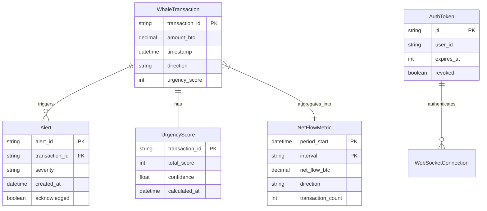

# Data Model: Real-Time Whale Detection Dashboard

**Feature**: Real-Time Whale Detection Dashboard
**Date**: 2025-11-25

## Entity Definitions

### 1. WhaleTransaction

Core entity representing a Bitcoin transaction exceeding the threshold.

```python
class WhaleTransaction:
    """Bitcoin transaction exceeding 100 BTC threshold"""

    # Identity
    transaction_id: str          # Bitcoin transaction hash
    block_height: Optional[int]  # Block number (null if mempool)

    # Transaction data
    amount_btc: Decimal         # Transaction amount in BTC
    amount_usd: Decimal         # USD equivalent at detection time
    timestamp: datetime         # Detection timestamp

    # Classification
    direction: Literal["BUY", "SELL", "TRANSFER"]  # Transaction type
    urgency_score: int          # 0-100 urgency rating
    fee_rate: float             # Satoshis per vbyte

    # Metadata
    input_count: int            # Number of inputs
    output_count: int           # Number of outputs
    is_rbf: bool               # Replace-by-fee enabled
    confidence: float          # Detection confidence 0-1
```

### 2. NetFlowMetric

Aggregated whale activity over time periods.

```python
class NetFlowMetric:
    """Aggregated whale buy/sell pressure"""

    # Time window
    period_start: datetime      # Window start time
    period_end: datetime        # Window end time
    interval: Literal["1m", "5m", "1h", "24h"]  # Aggregation interval

    # Flow metrics
    total_buy_btc: Decimal      # Total BTC bought in period
    total_sell_btc: Decimal     # Total BTC sold in period
    net_flow_btc: Decimal       # Buy - Sell
    net_flow_usd: Decimal       # USD equivalent

    # Statistics
    transaction_count: int      # Number of whale transactions
    largest_tx_btc: Decimal     # Largest single transaction
    average_urgency: float      # Mean urgency score

    # Direction indicator
    direction: Literal["ACCUMULATION", "DISTRIBUTION", "NEUTRAL"]
    strength: float            # 0-1 signal strength
```

### 3. UrgencyScore

Calculated urgency metric for prioritization.

```python
class UrgencyScore:
    """Time-sensitivity calculation for whale transactions"""

    transaction_id: str         # Reference to WhaleTransaction

    # Score components (weights sum to 1.0)
    fee_component: float        # 0-40 points (40% weight)
    size_component: float       # 0-30 points (30% weight)
    velocity_component: float   # 0-20 points (20% weight)
    pattern_component: float    # 0-10 points (10% weight)

    # Final score
    total_score: int           # 0-100 combined score
    confidence: float          # Confidence in score accuracy

    # Calculation metadata
    calculated_at: datetime     # When score was computed
    algorithm_version: str      # Scoring algorithm version
```

### 4. Alert

User notification for significant events.

```python
class Alert:
    """Notification for extreme whale movements"""

    alert_id: str              # Unique alert identifier

    # Alert trigger
    transaction_id: str         # Reference to WhaleTransaction
    trigger_type: Literal["SIZE", "URGENCY", "PATTERN", "THRESHOLD"]
    threshold_value: Decimal    # What triggered (e.g., >500 BTC)

    # Alert details
    severity: Literal["LOW", "MEDIUM", "HIGH", "CRITICAL"]
    title: str                 # Short alert title
    message: str               # Detailed alert message

    # Delivery
    created_at: datetime        # When alert was generated
    delivered_at: Optional[datetime]  # When shown to user
    acknowledged: bool          # User acknowledgment status
    delivery_method: List[str]  # ["toast", "browser", "audio"]
```

### 5. AuthToken

JWT authentication token for WebSocket connections.

```python
class AuthToken:
    """JWT token for authenticated connections"""

    # Token identity
    jti: str                   # JWT ID (unique token identifier)
    user_id: str               # User identifier

    # Token claims
    issued_at: int             # Unix timestamp of issue
    expires_at: int            # Unix timestamp of expiry
    permissions: List[str]     # ["whale_view", "whale_alerts"]

    # Session metadata
    ip_address: str            # Client IP at issue time
    user_agent: str            # Browser user agent

    # Token management
    refresh_token: Optional[str]  # For token renewal
    revoked: bool              # Revocation status
```

## Relationships



## State Transitions

### Transaction Lifecycle

```
DETECTED → SCORED → CLASSIFIED → AGGREGATED → DISPLAYED
    ↓         ↓          ↓             ↓            ↓
  (new)   (urgency)  (buy/sell)   (net flow)   (UI feed)
              ↓
         ALERT_TRIGGERED
              ↓
         ALERT_DELIVERED
```

### WebSocket Connection States

```
DISCONNECTED → CONNECTING → AUTHENTICATING → CONNECTED → STREAMING
      ↑             ↓              ↓              ↓           ↓
      └─────── AUTH_FAILED    TOKEN_EXPIRED  ←───┴── CONNECTION_LOST
```

## Validation Rules

### WhaleTransaction
- `amount_btc` >= 100 (whale threshold)
- `urgency_score` between 0 and 100
- `direction` must be valid enum value
- `timestamp` cannot be future
- `fee_rate` >= 0

### NetFlowMetric
- `net_flow_btc` = `total_buy_btc` - `total_sell_btc`
- `period_end` > `period_start`
- `strength` between 0 and 1
- `transaction_count` >= 0

### Alert
- `severity` based on transaction amount:
  - CRITICAL: > 1000 BTC
  - HIGH: > 500 BTC
  - MEDIUM: > 250 BTC
  - LOW: > 100 BTC
- `delivered_at` >= `created_at`

### AuthToken
- `expires_at` > `issued_at`
- `expires_at` - `issued_at` <= 3600 (1 hour max)
- `permissions` non-empty
- `user_id` must exist in auth system

## Storage & Retention

| Entity | Storage | Retention | Indexing |
|--------|---------|-----------|----------|
| WhaleTransaction | DuckDB | 30 days | transaction_id, timestamp, amount_btc |
| NetFlowMetric | DuckDB | 90 days | period_start, interval |
| UrgencyScore | Memory | Session | transaction_id |
| Alert | DuckDB | 7 days | alert_id, created_at, severity |
| AuthToken | Redis | 1 hour | jti, user_id |

## Cache Strategy

### Client-Side (Browser)
- Transaction feed: 50 most recent (ring buffer)
- Net flow metrics: 24 hours (localStorage)
- Alerts: Session only (sessionStorage)

### Server-Side (Redis)
- Active WebSocket connections: TTL 1 hour
- Auth tokens: TTL 1 hour with refresh
- Rate limit counters: TTL 1 minute

## Performance Considerations

### Data Limits
- Max 50 transactions in UI feed (older pruned)
- Max 10,000 data points per chart
- Max 100 concurrent WebSocket connections
- Max 20 messages/second per connection

### Aggregation Strategy
- 1-minute: Real-time (no aggregation)
- 5-minute: Average of 1-minute windows
- 1-hour: Average of 5-minute windows
- 24-hour: Average of 1-hour windows

### Message Batching
- Batch window: 100ms
- Max batch size: 10 messages
- Priority ordering: Alerts > Transactions > Metrics

---

This data model provides the foundation for:
- WebSocket message contracts
- Database schema design
- Frontend state management
- API response structures